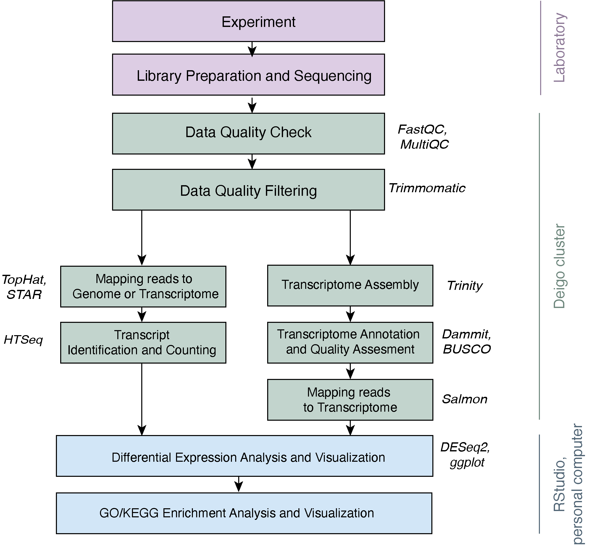

# RNA-Seq Mini Course
### OIST - February 8th, 10th, 15th, 17th, 2021
#### Taught by: Aleksandra (Sasha) Bliznina, PhD Student at Genomics and Regulatory Systems Unit

e-mail: aleksandra.bliznina2@oist.jp

### Course Resources

Github: https://github.com/aleksandrabliznina/rnaSeqMiniCourse

HackMD: https://hackmd.io/@aleksandrabliznina/rnaSeq_minicourse_1/edit

Stickies: Green = "everything is fine", Pink = "I need some help"

### Overview

RNA-sequencing (RNA-seq) has a wide variety of applications, but no single analysis pipeline can be used in all cases: https://genomebiology.biomedcentral.com/articles/10.1186/s13059-016-0881-8

RNA-seq is a widely used and extremely useful tool in biology, especially when working with non-model organisms that do not have published genomes. RNA-seq refers to using next-generation/high-throughput sequencing to sequence the mRNA in cell or tissue samples in order to determine which genes are being more or less expressed in certain conditions. RNA-seq can, therefore, provide insight into physiological states and molecular pathways associated with phenotypes of interest. In this cours, we will cover RNA-seq data analysis, starting with raw reads and ending with functional analyses.

**Workflow:**




#### Experiment and Library Prep Discussion

*experimental design: replicates, controls, library prep, sequencing depth, read length*

Technical replicates: use the same biological sample to repeat the technical or experimental steps.

Biological replicates: use different biological samples of the same condition to measure the biological variation between samples.

How many replicates are needed in an RNA-seq experiment and which differential expression tool should you use?     
(Schurch et al. 2016)       
https://www.ncbi.nlm.nih.gov/pubmed/27022035

Example: https://academic.oup.com/g3journal/article/7/1/221/6031506?login=true

They used RNA-Seq to to monitor mRNA levels of all genes in response to hypoxia of wild-type yeast, *Saccharomyces cerevisiae* (strain yMH914 with wildtype HAP1). To gain insights into how gene expression changes over time, cells were subjected to 100% nitrogen gas and collected after 0,5,10,30,60,120,180, and 240 minutes. Basically, they had 8 time points with 3 replicates per each point (24 samples in total).

---------

#### Data Quality Screening

During this course, we will work with yeast data from: https://www.ebi.ac.uk/ena/browser/view/PRJEB5348

We won't take all the samples, only three replicates per each condition, WT and *snf2* KO mutant. 

To start with, we need to download the data to the cluster. Deigo.

We will be working on Deigo. So login with ssh:
```
ssh aleksandrabliznina@deigo.oist.jp
```
(substitute aleksandrabliznina for your user name, **not your email address**)

check your location:
```
pwd
```

make a directory to work in for this course:
```
mkdir RNAseq
```

and move into your new directory:
```
cd RNAseq
```

make a directory for the raw data:
```
mkdir data
```

move into the directory for data:
```
cd data
```

Download yeast RNA-seq data from the open science framework ([link to the data])(https://www.ebi.ac.uk/ena/browser/view/PRJNA338913):

	curl -L ftp://ftp.sra.ebi.ac.uk/vol1/fastq/ERR458/ERR458493/ERR458493.fastq.gz -o ERR458493.fastq.gz
    curl -L ftp://ftp.sra.ebi.ac.uk/vol1/fastq/ERR458/ERR458494/ERR458494.fastq.gz -o ERR458494.fastq.gz
    curl -L ftp://ftp.sra.ebi.ac.uk/vol1/fastq/ERR458/ERR458495/ERR458495.fastq.gz -o ERR458495.fastq.gz
    curl -L ftp://ftp.sra.ebi.ac.uk/vol1/fastq/ERR458/ERR458500/ERR458500.fastq.gz -o ERR458500.fastq.gz
    curl -L ftp://ftp.sra.ebi.ac.uk/vol1/fastq/ERR458/ERR458501/ERR458501.fastq.gz -o ERR458501.fastq.gz
    curl -L ftp://ftp.sra.ebi.ac.uk/vol1/fastq/ERR458/ERR458502/ERR458502.fastq.gz -o ERR458502.fastq.gz

These commands download gzipped fastq files and rename them.

look at the zipped file:
```
gzip -cd ERR458493.fastq.gz | head -12
```

##### Check sequencing data quality (FastQC/MultiQC)

FastQC - A quality control tool for high throughput sequence data.
https://www.bioinformatics.babraham.ac.uk/projects/fastqc/

MultuQC - a modular tool to aggregate results from bioinformatics analyses across many samples.
https://multiqc.info/

We will run **Fastqc** on our data files first:

check if a tool is installed on Deigo:
```
ml avail
```

load FastQC:
```
ml load fastqc
```

check the list of modules you loaded:
```
ml list
```

load a particular version:
```
ml load fastqc/0.11.9
```

look at the help massege of the tool:
```
fastqc -h
```

make a slurm file to run fastqc on all of the data files: 

```
nano fastqc.slurm
```

	#!/bin/bash -l

	#SBATCH --job-name=fastqc_run
	#SBATCH --mail-user=aleksandra.bliznina2@oist.jp
	#SBATCH --mail-type=BEGIN,FAIL,END
	#SBATCH -p compute
	#SBATCH -t 0-1
	#SBATCH --mem=10G
	#SBATCH -c 6
	#SBATCH --input=none
	#SBATCH --output=fastqc_%j.out
	#SBATCH --error=fastqc_%j.err

	ml load fastqc

	fastqc ERR*.fastq.gz -t 6

Don't forget to change aleksandra.bliznina2@oist.jp to your e-mail in *--mail-user=your-e-mail* !!!

press *control + o* --> save    
press *control + x* --> exit

to run slurm file:
```
sbatch fastqc.slurm
```

check if it is running:
```
squeue
```

check what files we have in the current directory:
```
ls -l
```

After this job finishes running, there will be `fastqc.zip` and `fastqc.html` files in your data directory.

Secure copy one report to your local computer so that we can look at a report:    
open another terminal tab or window and `cd` to the directory you would like to move the fastqc to on your local computer. Then copy the report to your current working directory:

```
scp aleksandrabliznina@deigo.oist.jp:/home/a/aleksandrabliznina/RNAseq/data/ERR458493_fastqc.html . 
```

and to open the report:
```
open ERR458493_fastqc.html
```

Next, lets bundle up all of our fastqc reports into a single report with **MultiQC**:

Back in your tombo terminal, make a new slurm file to run Multiqc: 
```
nano multiqc.slurm
```

	#!/bin/bash -l

	#SBATCH --job-name=multiqc_run
	#SBATCH --mail-user=aleksandra.bliznina2@oist.jp
	#SBATCH --mail-type=BEGIN,FAIL,END
	#SBATCH -p compute
	#SBATCH -t 0-1
	#SBATCH --mem=10G
	#SBATCH -c 6
	#SBATCH --input=none
	#SBATCH --output=multiqc_%j.out
	#SBATCH --error=multiqc_%j.err

	ml use /apps/unit/GradschoolD/.modulefiles
	ml load RNA-seq/2.0
	
	export LC_ALL=C.UTF-8
	export LANG=C.UTF-8

	multiqc ERR*

press *control + o* --> save    
press *control + x* --> exit

to run the slurm file: 
```
sbatch multiqc.slurm
```

after this runs, you will have a new directory `multiqc_data` and a report `multiqc_report.html`

Again, we will move over the report for viewing on our local computer:
```
scp aleksandrabliznina@deigo.oist.jp:/home/a/aleksandrabliznina/RNAseq/data/multiqc_report.html .
```

and view the report: 
```
open multiqc_report.html
```

---------

#### Data Quality Filtering

Quality Trimming with **Trimmomatic**

http://www.usadellab.org/cms/?page=trimmomatic

Back in Deigo terminal, leave the raw data directory by moving up to the `RNAseq` directory: 
```
cd ..
```

make a new directory for quality trimmed data: 
```
mkdir data_trimmed
```

move into the new directory: 
```
cd data_trimmed
```

we will need to get the adapter file:
```
wget https://raw.githubusercontent.com/timflutre/trimmomatic/master/adapters/TruSeq2-SE.fa
```

make a slurm file to quality trim the data with Trimmomatic: 
```
nano trimmomatic.slurm
```

	#!/bin/bash -l

	#SBATCH --job-name=trimmomatic_run
	#SBATCH --mail-user=aleksandra.bliznina2@oist.jp
	#SBATCH --mail-type=BEGIN,FAIL,END
	#SBATCH -p compute
	#SBATCH -t 0-1
	#SBATCH --mem=10G
	#SBATCH -c 6
	#SBATCH --input=none
	#SBATCH --output=trimmomatic_%j.out
	#SBATCH --error=trimmomatic_%j.err
	#SBATCH --array 493,494,495,500,501,502

	DIR=/apps/free81/Trimmomatic/0.33/lib
	DATA=~/RNAseq/data

	java -jar $DIR/trimmomatic-0.33.jar SE $DATA/ERR458${SLURM_ARRAY_TASK_ID}.fastq.gz \
	ERR${SLURM_ARRAY_TASK_ID}.qc.fastq.gz \
    ILLUMINACLIP:TruSeq2-SE.fa:2:30:10 \
    LEADING:3 TRAILING:2 \
    SLIDINGWINDOW:4:10 \
    HEADCROP:11 \
    MINLEN:25

press *control + o* --> save    
press *control + x* --> exit

*example if running paired-end data*

	java -jar $DIR/trimmomatic-0.33.jar PE \
	$DATA/ERR458${SLURM_ARRAY_TASK_ID}_R1.fastq.gz $DATA/ERR458${SLURM_ARRAY_TASK_ID}_R2.fastq.gz \
	ERR${SLURM_ARRAY_TASK_ID}_R1.qc.fastq.gz ERR${SLURM_ARRAY_TASK_ID}_R1.up.qc.fastq.gz \
	ERR${SLURM_ARRAY_TASK_ID}_R2.qc.fastq.gz ERR${SLURM_ARRAY_TASK_ID}_R2.up.qc.fastq.gz \
    ILLUMINACLIP:TruSeq3-SE.fa:2:30:10 \
    LEADING:3 TRAILING:3 \
    SLIDINGWINDOW:4:15 \
    HEADCROP:11 \
    MINLEN:25

to run the slurm file: 
```
sbatch trimmomatic.slurm
```

As output, we will get new files for each sample, such as `ERR493.qc.fastq.gz`, and in the log files for each sample we can see how many of our sequences were discarded.

Lets see if our quality reports have changed at all: 
```
nano quality.slurm
```

	#!/bin/bash -l

	#SBATCH --job-name=quality_check_run
	#SBATCH --mail-user=aleksandra.bliznina2@oist.jp
	#SBATCH --mail-type=BEGIN,FAIL,END
	#SBATCH -p compute
	#SBATCH -t 0-1
	#SBATCH --mem=10G
	#SBATCH -c 6
	#SBATCH --input=none
	#SBATCH --output=qc_%j.out
	#SBATCH --error=qc_%j.err

	module use /apps/unit/GradschoolD/.modulefiles
	module load RNA-seq/2.0
	module load fastqc

	export LC_ALL=C.UTF-8
	export LANG=C.UTF-8
	
	fastqc ERR*.qc.fastq.gz -t 6
	multiqc ERR*

press *control + o* --> save    
press *control + x* --> exit

to run the slurm file: 
```
sbatch quality.slurm
```

rename the multiqc report: 
```
mv multiqc_report.html multiqc_report.qf.html
```

Copy the report to our local computer for viewing:
```
scp aleksandrabliznina@deigo.oist.jp:/home/a/aleksandrabliznina/RNAseq/data_trimmed/multiqc_report.qf.html .
```

View the report: 
```
open multiqc_report.qf.html
```

---------

#### Assemble the transcriptome with Trinity

https://github.com/trinityrnaseq/trinityrnaseq/wiki

Run Trinity and assemble transcriptome.

move to `RNAseq` directory: 
```
cd ..
```

make a directory for the trinity results: 
```
mkdir trinity_results
```

move into the new directory:
```
cd trinity_results
```

unpack trimmed fastq files:
```
gunzip ../data_trimmed/*.qc.fastq.gz
``` 

make a slurm file to run trinity:
```
nano trinity.slurm
```

	#!/bin/bash -l

	#SBATCH --job-name=trinity_run
	#SBATCH --mail-user=aleksandra.bliznina2@oist.jp
	#SBATCH --mail-type=BEGIN,FAIL,END
	#SBATCH -p compute
	#SBATCH -t 0-3
	#SBATCH --mem=20G
	#SBATCH -c 8
	#SBATCH --input=none
	#SBATCH --output=trinity_%j.out
	#SBATCH --error=trinity_%j.err

	module use /apps/unit/GradschoolD/.modulefiles
	module load RNA-seq/2.0
	module load samtools

	DATA=~/RNAseq/data_trimmed
	DIR=~/RNAseq/trinity_results

	Trinity --seqType fq --max_memory 20G \
	--single $DATA/ERR493.qc.fastq,$DATA/ERR494.qc.fastq,$DATA/ERR495.qc.fastq,$DATA/ERR500.qc.fastq,$DATA/ERR501.qc.fastq,$DATA/ERR502.qc.fastq \
	--CPU 8 --output $DIR

press *control + o* --> save    
press *control + x* --> exit

to run the slurm file: 
```
sbatch trinity.slurm
```

This should take about 2 hours to run. The directoty `trinity_results` will contain a new transcriptome assembly - `Trinity.fasta`

**Discussion:** How can you tell if your assembly is a good assembly?

https://github.com/trinityrnaseq/trinityrnaseq/wiki/Transcriptome-Assembly-Quality-Assessment

What is N50? https://www.molecularecologist.com/2017/03/whats-n50/

Does it matter for transcriptomes?
https://www.molecularecologist.com/2017/05/n50-for-transcriptome-assemblies/

---------

#### Read mapping

We will map our data to the reference genome. Where do you download your reference genome from?

* Ensemble: https://asia.ensembl.org/index.html
* NCBI: https://www.ncbi.nlm.nih.gov/
* DB specific for a group of organisms, f.ex., Aniseed: https://www.aniseed.cnrs.fr/aniseed/  
* DB specific for an organism, f.ex., TAIR (*Arabidopsis*): https://www.arabidopsis.org/

Lets dowload a reference genome sequence of *Saccharomyces cerevisiae* from Ensemble.

Genome size: 12 MB, 16 chromosomes

move to `RNAseq` directory: 
```
cd ..
```

make a directory for the reference genome:
```
mkdir genome
```

move into the new directory:
```
cd genome
```

look at the README file:
```
curl -L ftp://ftp.ensembl.org/pub/release-102/fasta/saccharomyces_cerevisiae/dna/README -o README 
less README
```

press *q* --> exit

download chromosome sequences:
```
curl -L ftp://ftp.ensembl.org/pub/release-102/fasta/saccharomyces_cerevisiae/dna/Saccharomyces_cerevisiae.R64-1-1.dna_sm.chromosome.I.fa.gz -o chr_1.fa.gz
curl -L ftp://ftp.ensembl.org/pub/release-102/fasta/saccharomyces_cerevisiae/dna/Saccharomyces_cerevisiae.R64-1-1.dna_sm.chromosome.II.fa.gz -o chr_2.fa.gz
curl -L ftp://ftp.ensembl.org/pub/release-102/fasta/saccharomyces_cerevisiae/dna/Saccharomyces_cerevisiae.R64-1-1.dna_sm.chromosome.III.fa.gz -o chr_3.fa.gz
curl -L ftp://ftp.ensembl.org/pub/release-102/fasta/saccharomyces_cerevisiae/dna/Saccharomyces_cerevisiae.R64-1-1.dna_sm.chromosome.IV.fa.gz -o chr_4.fa.gz
curl -L ftp://ftp.ensembl.org/pub/release-102/fasta/saccharomyces_cerevisiae/dna/Saccharomyces_cerevisiae.R64-1-1.dna_sm.chromosome.V.fa.gz -o chr_5.fa.gz
curl -L ftp://ftp.ensembl.org/pub/release-102/fasta/saccharomyces_cerevisiae/dna/Saccharomyces_cerevisiae.R64-1-1.dna_sm.chromosome.VI.fa.gz -o chr_6.fa.gz
curl -L ftp://ftp.ensembl.org/pub/release-102/fasta/saccharomyces_cerevisiae/dna/Saccharomyces_cerevisiae.R64-1-1.dna_sm.chromosome.VII.fa.gz -o chr_7.fa.gz
curl -L ftp://ftp.ensembl.org/pub/release-102/fasta/saccharomyces_cerevisiae/dna/Saccharomyces_cerevisiae.R64-1-1.dna_sm.chromosome.VIII.fa.gz -o chr_8.fa.gz
curl -L ftp://ftp.ensembl.org/pub/release-102/fasta/saccharomyces_cerevisiae/dna/Saccharomyces_cerevisiae.R64-1-1.dna_sm.chromosome.IX.fa.gz -o chr_9.fa.gz
curl -L ftp://ftp.ensembl.org/pub/release-102/fasta/saccharomyces_cerevisiae/dna/Saccharomyces_cerevisiae.R64-1-1.dna_sm.chromosome.X.fa.gz -o chr_10.fa.gz
curl -L ftp://ftp.ensembl.org/pub/release-102/fasta/saccharomyces_cerevisiae/dna/Saccharomyces_cerevisiae.R64-1-1.dna_sm.chromosome.XI.fa.gz -o chr_11.fa.gz
curl -L ftp://ftp.ensembl.org/pub/release-102/fasta/saccharomyces_cerevisiae/dna/Saccharomyces_cerevisiae.R64-1-1.dna_sm.chromosome.XII.fa.gz -o chr_12.fa.gz
curl -L ftp://ftp.ensembl.org/pub/release-102/fasta/saccharomyces_cerevisiae/dna/Saccharomyces_cerevisiae.R64-1-1.dna_sm.chromosome.XIII.fa.gz -o chr_13.fa.gz
curl -L ftp://ftp.ensembl.org/pub/release-102/fasta/saccharomyces_cerevisiae/dna/Saccharomyces_cerevisiae.R64-1-1.dna_sm.chromosome.XIV.fa.gz -o chr_14.fa.gz
curl -L ftp://ftp.ensembl.org/pub/release-102/fasta/saccharomyces_cerevisiae/dna/Saccharomyces_cerevisiae.R64-1-1.dna_sm.chromosome.XV.fa.gz -o chr_15.fa.gz
curl -L ftp://ftp.ensembl.org/pub/release-102/fasta/saccharomyces_cerevisiae/dna/Saccharomyces_cerevisiae.R64-1-1.dna_sm.chromosome.XVI.fa.gz -o chr_16.fa.gz
curl -L ftp://ftp.ensembl.org/pub/release-102/fasta/saccharomyces_cerevisiae/dna/Saccharomyces_cerevisiae.R64-1-1.dna_sm.chromosome.Mito.fa.gz -o chr_mito.fa.gz
```

unpack the files:
```
gunzip chr_*
```

and merge them into one FASTA file:
```
cat chr_* > Sce.R64-1-1.all.fa
```

look at the FASTA file to see how genome sequence looks like:
```
less Sce.R64-1-1.all.fa
```

press *q* --> exit

check if you have all the chromosomes:
```
grep '>' Sce.R64-1-1.all.fa | wc -l
```

remove single chromosome files:
```
rm chr_*
```

*be careful with the `rm` comand so you do no delete something you are not supposed to :)*

Next, we need an annotation file for the genome. Mosto common file formats tfor genome annotations are GTF/GFF

GFF3 - General Feature Format file: http://gmod.org/wiki/GFF3
GTF - General Transfer Format file: https://asia.ensembl.org/info/website/upload/gff.html ; GTF is another file format that is very similar to GFF2 and is sometimes referred to as GFF2.5. But, basically, it is a tightening of the GFF format. 

You have to choose the file format based on the software you are planning to read mapping and counting with. If you don't find a file you nee, there are software that can easily conver one to another. For example, [GenomeTools](http://genometools.org/).    

We are planning to use STAR to map the reads and HTSeq to count them. Both software accept GTF file. So we will go ahead and dowload it:

```
curl -L ftp://ftp.ensembl.org/pub/release-102/gtf/saccharomyces_cerevisiae/Saccharomyces_cerevisiae.R64-1-1.102.gtf.gz -o Sce.R64-1-1.gm.gtf.gz
gunzip Sce.R64-1-1.gm.gtf.gz
```

look at the GTF file:
```
less Sce.R64-1-1.gm.gtf
```

press *q* --> exit

look at the chromosome names in the FASTA file:
```
grep '>' Sce.R64-1-1.all.fa | head
``` 

remove additional information from teh FASTA headers:
```
sed -i 's/\s.*$//' Sce.R64-1-1.all.fa
```

Now as we have our genome and annotation files, we can go ahead and align our trimmed RNA-Seq data to the genome using **STAR**.

https://github.com/alexdobin/STAR

move to `RNAseq` directory: 
```
cd ..
```

make a directory for the STAR results:
```
mkdir star_results
```

move into the new directory:
```
cd star_results
```

First, we have to index our genome. But for what?

*Indexing a genome can be explained similar to indexing a book. If you want to know on which page a certain word appears or a chapter begins, it is much more efficient/faster to look it up in a pre-built index than going through every page of the book until you found it. Same goes for alignments. Indices allow the aligner to narrow down the potential origin of a query sequence within the genome, saving both time and memory.*

make a slurm file to run STAR index:
```
nano star_index.slurm
```

	#!/bin/bash -l

	#SBATCH --job-name=star_index_run
	#SBATCH --mail-user=aleksandra.bliznina2@oist.jp
	#SBATCH --mail-type=BEGIN,FAIL,END
	#SBATCH -p compute
	#SBATCH -t 0-1
	#SBATCH --mem=10G
	#SBATCH -c 4
	#SBATCH --input=none
	#SBATCH --output=star_index_%j.out
	#SBATCH --error=star_index_%j.err

	module use /apps/unit/GradschoolD/.modulefiles
	module load RNA-seq/2.0

	GENOME_DIR=~/RNAseq/genome

	STAR --runThreadN 4 --runMode genomeGenerate \
	--genomeDir $GENOME_DIR \
	--genomeFastaFiles $GENOME_DIR/Sce.R64-1-1.all.fa \
	--sjdbGTFfile $GENOME_DIR/Sce.R64-1-1.gm.gtf \
	--sjdbOverhang 39 \
	--genomeSAindexNbases 10

Manual for STAR: https://github.com/alexdobin/STAR/blob/master/doc/STARmanual.pdf

**sjdbOverhang**: *ReadLength - 1* (specifies the length of the genomic sequence arround the annotate junctions to be used in constructing the SJ database)

**genomeSAindexNbases**: *min(14, log2(GenomeLength)/2 -1)* (length of the SA pre-indexing strin; typically between 10 and 15)

press *control + o* --> save    
press *control + x* --> exit

to run the slurm file: 
```
sbatch star_index.slurm
```

After the job is finished, you can see index files created in `~/RNAseq/genome` directory:
```
ls -l ~/RNAseq/genome
```

Lets map reads to the genome now. Make a slurm file to start mapping:
```
nano star_map.slurm
```

	#!/bin/bash -l

	#SBATCH --job-name=star_map_run
	#SBATCH --mail-user=aleksandra.bliznina2@oist.jp
	#SBATCH --mail-type=BEGIN,FAIL,END
	#SBATCH -p compute
	#SBATCH -t 0-4
	#SBATCH --mem=15G
	#SBATCH -c 10
	#SBATCH --input=none
	#SBATCH --output=star_map_%j.out
	#SBATCH --error=star_map_%j.err
	#SBATCH --array 493,494,495,500,501,502

	module use /apps/unit/GradschoolD/.modulefiles
	module load RNA-seq/2.0

	GENOME_DIR=~/RNAseq/genome
	DATA=~/RNAseq/data_trimmed

	STAR --runThreadN 4 --genomeDir $GENOME_DIR \
	--readFilesIn $DATA/ERR${SLURM_ARRAY_TASK_ID}.qc.fastq \
	--outFileNamePrefix ERR${SLURM_ARRAY_TASK_ID}_

press *control + o* --> save    
press *control + x* --> exit

*example if running paired-end data*
	
	STAR --runThreadN 4 --genomeDir $GENOME_DIR \
	--readFilesIn $DATA/ERR${SLURM_ARRAY_TASK_ID}_R1.qc.fastq $DATA/ERR${SLURM_ARRAY_TASK_ID}_R2.qc.fastq \
	--outFileNamePrefix ERR${SLURM_ARRAY_TASK_ID}_

to run the slurm file: 
```
sbatch star_map.slurm
```

Whe job is finished running, you shoud see a bunch of SAM files in the `~/RNAseq/star_results` directory: one SAM file per sample. These files contain the reads aligned to the genome assembly.

You can find a description of the SAM file format here: https://samtools.github.io/hts-specs/SAMv1.pdf

Lets look at the mapping statistics:
```
less ERR493_Log.final.out
```
press *q* --> exit

---------

#### Read counting

Next step is to count how many reads do we have per each gene. We will use **htseq-count** for that:

https://htseq.readthedocs.io/en/release_0.11.1/count.html

move to `RNAseq` directory: 
```
cd ..
```

make a directory for the htseq results:
```
mkdir htseq_results
```

move into the new directory:
```
cd htseq_results
```

make a slurm file to run htseq-count:
```
nano htseq.slurm
```

	#!/bin/bash -l

	#SBATCH --job-name=htseq_count
	#SBATCH --mail-user=aleksandra.bliznina2@oist.jp
	#SBATCH --mail-type=BEGIN,FAIL,END
	#SBATCH -p compute
	#SBATCH -t 0-2
	#SBATCH --mem=10G
	#SBATCH -c 8
	#SBATCH --input=none
	#SBATCH --error=htseq_%j.err
	#SBATCH --array 493,494,495,500,501,502

	module use /apps/unit/GradschoolD/.modulefiles
	module load RNA-seq/2.0

	GENOME_DIR=~/RNAseq/genome
	STAR_DIR=~/RNAseq/star_results

	htseq-count -f sam -s yes -m intersection-nonempty \
	$STAR_DIR/ERR${SLURM_ARRAY_TASK_ID}_Aligned.out.sam \
	$GENOME_DIR/Sce.R64-1-1.gm.gtf > ERR${SLURM_ARRAY_TASK_ID}.counts

press *control + o* --> save    
press *control + x* --> exit

to run the slurm file: 
```
sbatch htseq.slurm
```

After the job is finished running, you will see a bunch of `*.counts` files:
```
less ERR493.counts
```

press *q* --> exit 

---------

Next, move the files for further analysis to your local computer.

```
scp aleksandrabliznina@deigo.oist.jp:/home/a/aleksandrabliznina/RNAseq/htseq_results/ERR*.counts .
```
